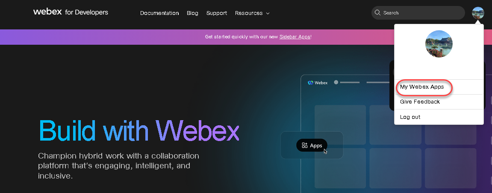
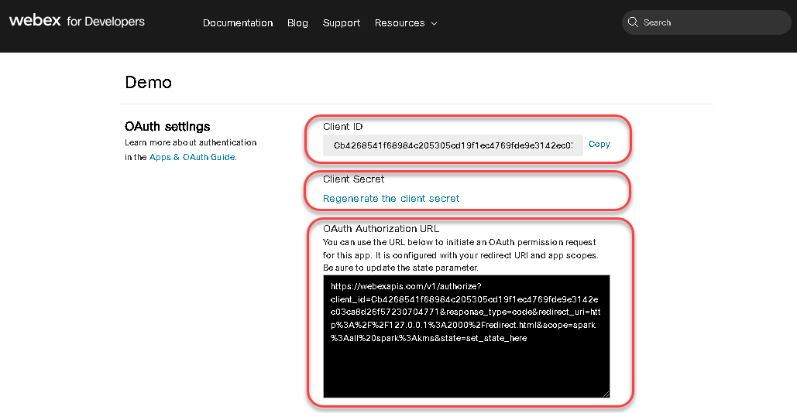
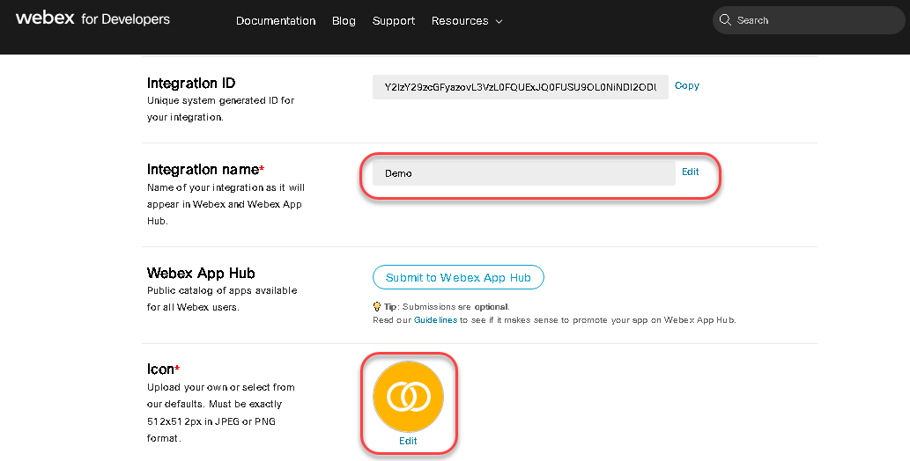
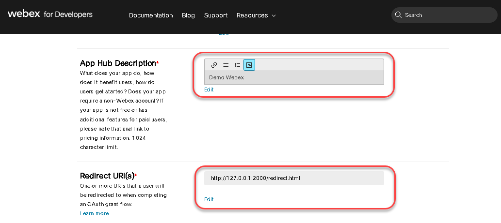
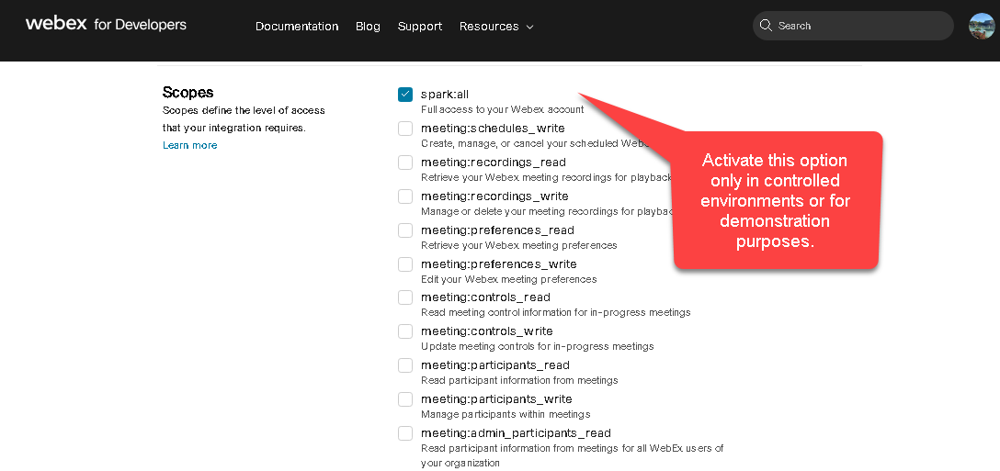
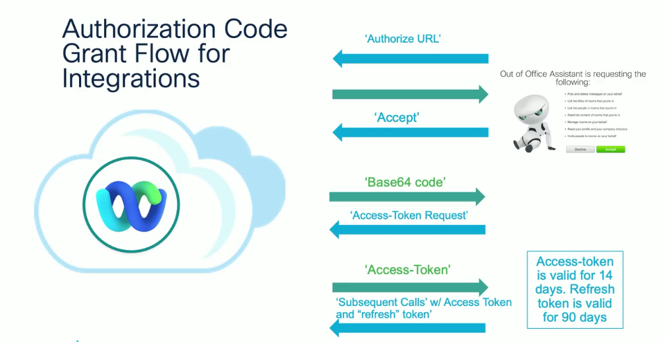
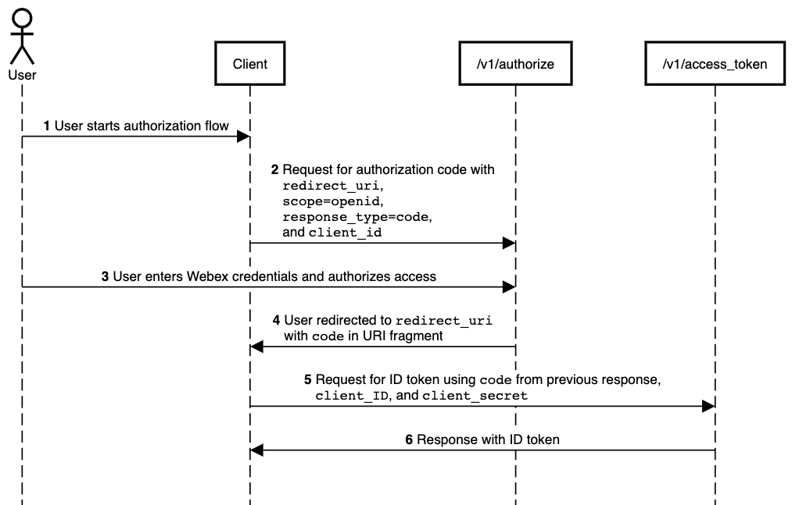

        
        <h1> The OAuth 2.0 Authorization for Webex integrations </h1>
        
 OAUTH 2.0 

        
 2023 

Authorization framework standard that allows a user to grant a
third-party web site or application access to the user's protected and
control access to their applications and resources.

Requirements

1.  Create an account in the portal web Webex for Developers
    <https://developer.webex.com/>.

2.  Create your Webex Apps

3.  Create a virtual environment in python 3.9 +

> Store the variables using environment variable in your system Linux.
>
> clientID =
> "Cb4268541f68984c205305cd19f1ec4769fde9e3142ec03ca8d26f57230704771"
>
> secretID =
> "2826a140ffe0643eb3a5ad2244ad33730e2ab787a44ca4c714d6cc4cb5896168"
>
> redirectURI = <http://127.0.0.1:2000/redirect.html>
>
> url =
> "https://webexapis.com/v1/authorize?client_id=Cb4268541f68984c205305cd19f1ec4769fde9e3142ec03ca8d26f57230704771&response_type=code&redirect_uri=http%3A%2F%2F127.0.0.1%3A2000%2Fredirect.html&scope=spark%3Aall%20spark%3Akms&state=set_state_here"
>
> Process in Linux:
>
> (oauth) devnet@PC1 ~/devnet/webex \$ export
> secretID="2826a140ffe0643eb3a5ad2244ad33730e2ab787a44ca4c714d6cc4cb5896168"
> \> ~/.
>
> bashrc
>
> (oauth) devnet@PC1 ~/devnet/webex \$ export
> clientID="Cb4268541f68984c205305cd19f1ec4769fde9e3142ec03ca8d26f57230704771"
> \> ~/
>
> .bashrc
>
> (oauth) devnet@PC1 ~/devnet/webex \$ source ~/.bashrc
>
> (oauth) devnet@PC1 ~/devnet/webex \$ echo \$secretID
>
> 2826a140ffe0643eb3a5ad2244ad33730e2ab787a44ca4c714d6cc4cb5896168
>
> (oauth) devnet@PC1 ~/devnet/webex \$ echo \$clientID
>
> Cb4268541f68984c205305cd19f1ec4769fde9e3142ec03ca8d26f57230704771
>
> (oauth) devnet@PC1 ~/devnet/webex \$

4.  Activate Flask in your virtual environment and install the libraries
    listed in requirements.txt

´´´python
devnet@PC1 ~/devnet/webex \$ python3.10 -m venv oauth
devnet@PC1 ~/devnet/webex \$ source oauth/bin/activate
devnet@PC1 ~/devnet/webex \$pip install -r requirements.txt
´´´

> **<u>Flow OAuth 2.0</u>**
>
> 
>
> Figure. Cisco Live – DEVNET 2675
>
> <https://www.ciscolive.com/on-demand/on-demand-details.html?#/video/1687390798629001IngZ>

References:

- Implementing OAuth 2.0 Authorization for Webex Integrations - DEVNET
  2675

<https://www.ciscolive.com/on-demand/on-demand-details.html?#/video/1687390798629001IngZ>
